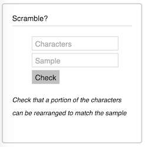

# Scramble?

Minimal full stack Clojure/Script application with [Rum](https://github.com/tonsky/rum)

Source codes formatted by following a style described in the blog post [Readable Clojure](http://tonsky.me/blog/readable-clojure)

## Overview

Check that a portion of the characters can be rearranged to match the sample

## Setup

To create a production build (uberjar) run:

    lein package

To run a production build:

    java -jar scramble.jar --port 8080

To get an interactive development environment run:

    lein figwheel

and open your browser at [localhost:3449](http://localhost:3449/).
This will auto compile and send all changes to the browser without the
need to reload. After the compilation process is complete, you will
get a Browser Connected REPL. An easy way to try it is:

    (js/alert "Am I connected?")

and you should see an alert in the browser window.

To clean all compiled files:

    lein clean

## License

Copyright © 2014 Aleksei Sotnikov

Distributed under the Eclipse Public License either version 1.0 or (at your option) any later version.
